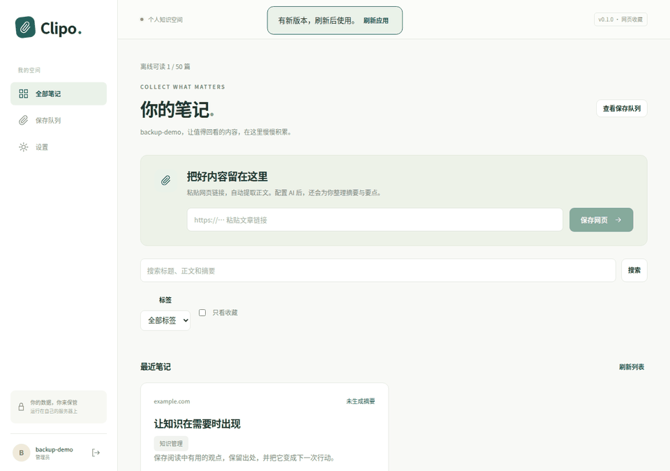

# Clipo

> 智能笔记应用，自动从小红书、小黑盒、网站等平台提取和整理内容

Clipo 是一个开源的自托管笔记应用，专注于从社交媒体和网站自动提取核心内容。通过 AI 智能总结和评论筛选，让你轻松保存和管理有价值的信息。



演示使用虚构账号与离线内容，展示实际页面。安装包与版本说明见 [Releases](https://github.com/tlwsy/Clipo/releases)。

**v0.1.0 已发布**，提供扩展 ZIP 与 SHA256SUMS；公开容器镜像为 `ghcr.io/tlwsy/clipo:v0.1.0`（linux/amd64）。下方 Compose 命令从源码构建，首次部署和备份恢复已通过 GitHub CI。

## 当前进度

已实现 [实施计划](IMPLEMENTATION_PLAN.md) 的 **Phase 2 核心链路**：保存公开网页、后台正文提取、AI 摘要与要点、笔记列表与详情、保存队列和失败重试，以及 PWA 分享入口。Phase 1 的账号、模型配置、API Token 和静态部署能力继续可用。

未配置模型或模型调用失败时，仍会保存原文，并显示“未生成摘要”。

**Phase 3 平台专项的计划内开发已完成。** 小红书与小黑盒支持正文、图片、作者、时间及顶层评论分页；Cookie 按账号加密保存，设置页可检测登录有效性。评论采集上限独立可配（0–100，0 关闭）；模型另有候选上限和高价值阈值，详情显示评分、理由及高价值标记。用户提供的两平台真实帖子与模型均已通过完整链路验收。

B 站和 YouTube 支持视频简介、公开可取得的字幕和顶层热评，字幕或评论不可取得会明确提示。B 站真实元数据与评论已验证；YouTube 已通过离线与浏览器验证，但当前环境无法解析其域名，线上验收待网络就绪。

**Phase 4 已实现标签、收藏、中文检索和 PWA 离线阅读与同步。** Shortcut 已提供设备自动配置、设置页安装入口和剪贴板保存；用户于 2026-09-22 确认发布的 iCloud 版本完成 iOS 实机核验。仓库未签名模板的 Mac 签名与导入未另行验证。Docker Compose 已验证构建、启动、迁移与健康检查，PostgreSQL 16 专项测试已通过。Phase 5 浏览器扩展已实现并通过本地 Chromium 验收；真实平台登录浏览器与 Edge 待验收，Phase 6 已提供 JSON/Markdown 导出、JSON 恢复与本地/S3/WebDAV 备份。完整状态与验收限制见 [构建进度](docs/progress.md)。

## ✨ 目标特性（按阶段建设）

- **智能提取**：自动从小红书、小黑盒、网站、视频等平台抓取内容
- **AI 总结**：使用大语言模型智能总结核心信息
- **评论筛选**：自动识别和保存有价值的评论
- **多端支持**：PWA、浏览器扩展、iOS Shortcut 多种保存方式
- **自托管**：完全控制自己的数据和隐私
- **离线访问**：PWA 支持离线缓存，随时查看笔记
- **灵活备份**：支持本地导出、S3、WebDAV 多种备份方式

## 🚀 快速开始

### 使用 Docker Compose（推荐）

```bash
# 获取源码（已下载源码可跳过）
git clone https://github.com/tlwsy/Clipo.git
cd Clipo

# 在仓库根目录生成 .env 和随机密钥（不会覆盖已有配置）
python3 scripts/init_env.py

# 从源码构建并启动应用与 PostgreSQL
docker compose up --build -d

# 访问 http://localhost:8000
```

首次访问会进入设置向导，按提示完成配置即可。

### 本地开发（无需 Docker）

需要 Python 3.11+、[uv](https://docs.astral.sh/uv/)、Node.js 20+ 和 npm。

```bash
make install
make configure
make dev
```

访问 `http://localhost:3000`。默认使用 SQLite，API 运行在 8000 端口。执行 `make build && make serve` 可在 `http://localhost:8000` 检查与容器相同的静态托管模式。

### 环境要求

- Docker 20.10+
- Docker Compose 2.0+
- 2GB+ 可用内存
- 10GB+ 磁盘空间（取决于保存的内容量）

## 📱 客户端

PWA、浏览器扩展与 iCloud Shortcut 安装入口已提供；Shortcut 发布版本已由用户完成 iOS 实机核验。

### PWA（Web App）

通过 HTTPS 访问服务（本机 localhost 可用 HTTP），在浏览器安装 Clipo：

- Android Chrome：安装后，从浏览器分享菜单选择 Clipo，自动保存公开网页。
- 桌面 / iOS：在首页粘贴链接保存；iOS 分享与剪贴板保存可按下方 Shortcut 教程配置。
- 分享时未登录会先登录，再继续保存。生产构建支持离线阅读最近 50 篇已缓存笔记和暂存操作，使用条件见 [离线阅读与同步](docs/offline.md)。

网页链接须使用 HTTP(S) 和 80/443 端口，拒绝内网地址。通用网页只支持公开静态 HTML；小红书支持 `/explore/帖子ID`、`/discovery/item/帖子ID` 和 `xhslink.com` / `xhslink.cn` 短链接，可在设置中填写 Cookie 后采集。小黑盒支持 `/app/bbs/link/帖子ID` 和官方 API 分享链接，最多采集 100 条顶层评论；小红书保留页面已有评论；配置完整 Cookie 并使用带访问参数的帖子链接时，按采集上限补抓顶层评论分页，不执行页面 JavaScript；设置仅对后续执行的任务生效，已有笔记不变。Android 系统分享面板仍需真机验收。

### 浏览器扩展

在 Chrome/Edge 扩展管理页开启开发者模式，“加载已解压的扩展程序”选择 `extension/`。配置 Clipo 地址与 API Token 并授权该服务器后，可从弹窗或右键保存网页、选区、小红书/小黑盒可见评论。`make extension-package` 可生成 ZIP。已通过 Chromium 离线端到端验收；真实平台与 Edge 待验收。安装、权限及限制见 [浏览器扩展文档](docs/extension.md)。

### iOS Shortcut

设置 → iPhone 快捷指令 → 安装快捷指令 → 生成设备配置 → 打开快捷指令并配置。服务器生成 5 分钟一次性配置码，设备领取地址和专用 Token，无需手填凭据；无分享输入时从剪贴板提取首个链接，适用于小红书／小黑盒的“复制链接”。需先安装支持自动配置的新版。

[安装“保存到 Clipo”](https://www.icloud.com/shortcuts/0cfcf8c51dcc4c2f9bc6d621e5d2dd09)。`.env.example` 已配置此链接，已有部署按 [Shortcut 配置与验收](shortcuts/README.md) 设置 `CLIPO_SHORTCUT_INSTALL_URL` 并重启服务。内置 `/shortcuts/` 指南保留自定义制作步骤；用户实机确认针对此 iCloud 版本，仓库未签名模板需另行签名验证。旧版固定地址/Token 指令不兼容。

## 📖 文档

- [构建进度](docs/progress.md) - 当前可用功能、验证结果与后续范围
- [技术架构](ARCHITECTURE.md) - 系统架构和技术选型
- [开发指南](DEVELOPMENT.md) - 开发环境搭建和实施计划
- [API 文档](docs/api.md) - RESTful API 参考
- [浏览器扩展](docs/extension.md) - 扩展开发和使用
- [iOS Shortcut](docs/ios-shortcut.md) - Shortcut 配置指南
- [配置参考](docs/configuration.md) - 详细配置说明
- [部署指南](docs/deployment.md) - 生产环境部署
- [备份与恢复](docs/backup.md) - JSON/Markdown、本地/S3/WebDAV 与恢复步骤

## 🛠️ 技术栈

- **后端**: Python 3.11+ / FastAPI / PostgreSQL
- **前端**: React 18 / Next.js 14 / PWA
- **AI**: OpenAI 兼容 HTTP 客户端 / Pydantic 结构化校验
- **提取与队列**: trafilatura / readability / Huey（SQLite 持久化队列）
- **部署**: Docker / Docker Compose

## 🤝 贡献

欢迎提交 Issue 和 Pull Request！

在提交代码前，请确保：
- 代码通过 `make lint` 检查
- 测试通过 `make test`
- 更新相关文档

详见 [贡献指南](CONTRIBUTING.md)

## 📄 开源协议

本项目采用 [AGPL v3](LICENSE) 协议开源。

这意味着：
- ✅ 可以自由使用、修改、分发
- ✅ 可以用于商业目的
- ❗ 修改后的代码必须同样开源（包括网络服务）
- ❗ 必须保留原作者版权声明

## 🙏 致谢

- [DrissionPage](https://github.com/g1879/DrissionPage) - 强大的网页自动化工具
- [LangChain](https://github.com/langchain-ai/langchain) - LLM 应用开发框架
- [FastAPI](https://fastapi.tiangolo.com/) - 现代 Python Web 框架

## 📧 联系方式

- Issues: [GitHub Issues](https://github.com/tlwsy/Clipo/issues)
- Discussions: [GitHub Discussions](https://github.com/tlwsy/Clipo/discussions)

---

**注意**：本项目为自托管应用，所有数据保存在你自己的服务器上。LLM API 费用由用户自行承担。


### 标签与收藏

笔记详情可添加/移除标签、标记收藏，首页可组合筛选。AI 建议自动归入标签；升级前备份数据库，执行 `make upgrade` 后，旧笔记建议也会补为可管理标签。删除标签不会删除笔记。

### 全文搜索

首页搜索标题、原始正文和摘要，支持中文短词，空格分隔多个关键词可组合匹配，并可叠加标签和收藏筛选。SQLite 使用 FTS5 trigram，1–2 字符词回退字面匹配；PostgreSQL 使用 `simple` tsvector/GIN 并回退字面匹配，默认 PostgreSQL 16 镜像无需中文扩展即可检索中文。若管理员在迁移前已安装 `pg_bigm`，迁移会额外创建双字索引。大库无中文扩展时中文检索可能较慢；不提供相关度排序。

### 离线阅读

生产构建会预缓存最近 50 篇笔记，顶部显示实际缓存数量。离线可搜索和阅读已缓存笔记、收藏、删除和暂存链接；恢复网络后保持应用打开即可同步。标签编辑和设置需联网。图片仍为外链，新版本可点击提示条刷新。账号隔离、清理规则与限制见 [离线阅读与同步](docs/offline.md)。

### Docker 验证

当前 Compose 已在 Docker Desktop 实机通过镜像构建、空 PostgreSQL 初始化、全部迁移、应用健康检查与静态首页检查：`docker compose up -d` 后访问 `http://localhost:8000`，停止使用 `make down`。首次运行需在 `.env` 设置 `POSTGRES_PASSWORD` 与 `CLIPO_SECRET_KEY`。Phase 6 已在独立空 Compose 中验证浏览器设置向导、创建账号、内容直传、worker 落库、摘要降级、中文检索和备份下载；真实平台网络采集不包含在该容器验收中。

### 备份与恢复

设置 → 备份与恢复可导出包含 `library.json` 与 Markdown 目录的 ZIP；在新实例选择解压后的 JSON 即可恢复原文、摘要、评论评分、标签、收藏、时间与媒体链接。导入追加到当前账号，相同文件重复提交不会重复添加。

本地、S3 兼容和 WebDAV 均支持手动备份与 Cron 定时计划。下载副本默认保留 7 天，本地目标保留最近 10 份。凭据按账号加密保存；当前图片仅保存外链，JSON 上限 100 MiB。完整实例备份另需数据库和主密钥，见[备份与恢复](docs/backup.md)。
