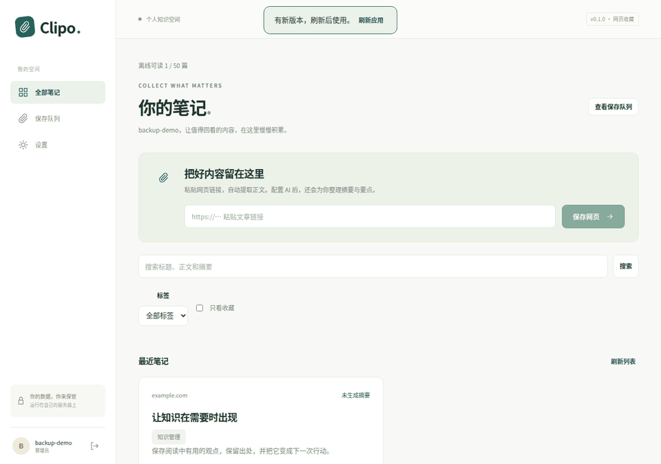

# Clipo

<p align="center">
  <strong>智能、轻量、自托管的个人内容采集与 AI 知识库</strong>
</p>

<p align="center">
  自动从小红书、小黑盒、B站、YouTube 及各类网站提取核心正文与高价值讨论，结合大模型提炼结构化摘要，全端无缝同步。
</p>

<p align="center">
  <a href="https://github.com/tlwsy/Clipo/releases"></a>
  <a href="https://github.com/tlwsy/Clipo/pkgs/container/clipo"></a>
  <a href="LICENSE"></a>
  <a href="https://fastapi.tiangolo.com/"></a>
  <a href="https://nextjs.org/"></a>
</p>

---

<p align="center">
  
</p>

<p align="center"><em>Clipo 核心界面：内容提取、AI 结构化摘要、评论筛选与备份管理</em></p>

---

## 🌟 为什么选择 Clipo？

在社交媒体与海量网页中，最有价值的信息往往不仅存在于正文中，还散落在热门讨论与高手评论里。传统的“稍后读”工具往往只能抓取冰冷的网页正文，且面对现代富客户端与国内社交平台时频频失效。

**Clipo** 专为现代网络内容而生：
- 📱 **深度适配主流平台**：深度支持小红书、小黑盒、B站、YouTube 及通用文章，提取正文、图集、字幕乃至楼中楼评论。
- 🧠 **AI 核心提炼与评论洞察**：不仅提供 Markdown 摘要与核心要点，还独创评论初筛与 AI 价值评分，帮你自动滤除灌水、揪出高信息量讨论。
- ⚡ **无感多端录入**：支持 PWA 原生分享菜单、Chrome/Edge 浏览器扩展（DOM 直传）、iOS 快捷指令一键配置保存，随时随地一键入库。
- 🔒 **数据绝对自主**：自托管部署，所有笔记、凭据加密保存在你自己的服务器；内置中文全文检索，无需维护 Elasticsearch 等笨重引擎。
- 📦 **极简轻量架构**：FastAPI + Next.js 静态托管，后台任务由 Huey + SQLite 持久化队列驱动，**无需 Redis**，单台小规格 VPS 或 Docker 即可丝滑运行。

---

## ✨ 核心特性

### 1. 多平台深度提取
- **小红书 (RED)**：完整抓取图文、多图轮播、作者、发布时间，支持带访问凭据的分页抓取与评论楼中楼展开。
- **小黑盒 (HeyBox)**：抓取资讯长文、动态卡片、图文混排与结构化楼中楼评论。
- **视频平台**：支持 Bilibili 与 YouTube，自动提取视频信息、热评与公开字幕（CC 字幕）。
- **通用网页**：基于 Trafilatura 与 Readability 双引擎，精准提取主要正文，剥离广告与冗余标签，内置企业级 SSRF 防护。

### 2. AI 智能总结与深度挖掘
- **兼容任意大模型**：标准 OpenAI 接口兼容，支持接入 DeepSeek、通义千问、Kimi (Moonshot)、OpenAI 或 One API 等网关。
- **结构化摘要**：自动生成精炼 Markdown 概述、分条要点清单，并智能推荐分类标签。
- **评论价值评分与精华提炼**：初筛互动较高的讨论，由 AI 逐条评估信息量（附带评分与理由），标记高价值讨论，置顶精华观点。
- **灵活降级与重提**：模型不可用或网络异常时原样保留原文，后续可在笔记详情中**一键重新生成摘要**。

### 3. 多端无缝录入生态
- **笔记来源名称**：已识别平台显示平台名，普通网页优先显示站点提供的名称，缺失时显示域名；支持已有网页快照和离线笔记。
- **PWA (渐进式 Web 应用)**：支持系统级原生分享（Android Share Target 一键分享到 Clipo）、离线阅读最近 50 篇笔记、离线操作自动同步。
- **浏览器扩展 (Chrome / Edge)**：提供 Manifest V3 扩展，支持网页一键入库、划词选区保存，并可直接在宿主页面直取 DOM 与登录态评论直传，无惧平台反爬。
- **iOS 快捷指令 (Shortcut)**：提供官方一键安装链接与 5 分钟免密自动配对机制，支持 iOS 系统分享菜单或剪贴板链接自动捕获。
- **开放 RESTful API**：规范的 OpenAPI 契约，方便与自动化工作流（如 Raycast、Alfred、Webhook）轻松集成。

### 4. 知识管理与检索
- **多空间组织**：创建带颜色和图标的空间，一篇笔记可归属多个空间；支持列表多选添加、空间内添加与移除，删除空间保留笔记。详见 [空间指南](docs/collections.md)。
- **灵活标签与收藏**：手动打标与 AI 自动分类相结合，支持多维度组合筛选与快速收藏。
- **中文全文检索**：针对中文深度优化。PostgreSQL 环境采用高效 `tsvector` + GIN 索引；SQLite 环境采用 FTS5 trigram 引擎，零额外依赖即可实现毫秒级即时搜索。
- **安全公开分享**：支持生成可自定义过期时间或永久有效的只读公开链接，随时可一键撤回；公开视图自动脱敏个人标签与私密信息，并内置访问频率保护。

### 5. 数据自主与备份迁移
- **一键打包导出**：随时导出包含结构化 `library.json`、标准 Markdown 目录树和完整媒体元数据的归档包。
- **全量无损恢复**：支持上传备份包一键恢复全部笔记、评论、AI 摘要与标签，支持幂等追加。
- **自动化多端备份**：原生支持本地备份、S3 兼容对象存储（AWS S3、MinIO、Cloudflare R2 等）和 WebDAV，支持内置 Cron 定时自动归档与生命周期清理。

---

## 🚀 快速上手

### ⚡ 方式一：一行命令极速安装（推荐）

#### 选项 A：一行 Docker 命令（单容器模式，开箱即用）

无需任何额外配置或下载仓库源码，内置轻量 SQLite 数据库与任务队列，复制并在终端执行即可秒级启动：

```bash
docker run -d \
  --name clipo \
  -p 8000:8000 \
  -v clipo_data:/app/data \
  -e CLIPO_SECRET_KEY=$(openssl rand -hex 32) \
  --restart unless-stopped \
  ghcr.io/tlwsy/clipo:latest
```

启动后在浏览器打开 `http://localhost:8000` 即可进入初始化设置向导！所有笔记数据和队列状态自动保存在 Docker 命名卷 `clipo_data` 中。

---

#### 选项 B：一行命令拉起 Docker Compose（生产环境，含 PostgreSQL 16）

一条复合命令自动创建目录、下载官方 compose 文件与环境模板、生成安全随机密钥并拉取官方镜像启动：

```bash
mkdir -p clipo && cd clipo && \
curl -fsSL https://raw.githubusercontent.com/tlwsy/Clipo/main/docker-compose.yml -o docker-compose.yml && \
curl -fsSL https://raw.githubusercontent.com/tlwsy/Clipo/main/.env.example -o .env && \
sed -i "s/CLIPO_SECRET_KEY=/CLIPO_SECRET_KEY=$(openssl rand -hex 32)/" .env && \
sed -i "s/POSTGRES_PASSWORD=clipo-local-change-me/POSTGRES_PASSWORD=$(openssl rand -hex 24)/" .env && \
docker compose up -d
```

启动完成后同样访问 `http://localhost:8000` 即可。

---

### 📦 方式二：克隆仓库快速启动

如果你已经克隆了本代码仓库：

```bash
git clone https://github.com/tlwsy/Clipo.git
cd Clipo

# 1. 初始化本地环境配置与随机主密钥（不覆盖已有 .env）
python3 scripts/init_env.py

# 2. 直接拉取官方预构建镜像并后台启动（无需本地编译）
docker compose up -d

# 3. 查看运行状态
docker compose logs -f app
```

服务启动后，使用浏览器访问 `http://localhost:8000`。
首次访问将自动引导进入**设置向导**，创建管理员账户并配置模型接入点即可开始使用！

> 💡 **镜像与升级说明**：
> - **一键升级**：Compose 升级仅需执行 `docker compose pull && docker compose up -d`；单容器模式执行 `docker pull ghcr.io/tlwsy/clipo:latest` 并重启容器即可。启动时系统会自动执行增量数据迁移，数据卷持久化保留。
> - **二次开发**：若需要自行修改源码调试，可执行 `docker compose up --build -d` 从本地源码重新构建容器。详细部署与反向代理配置见 [部署指南](docs/deployment.md)。

---

### 方式二：本地源码运行（开发者 / 轻量体验）

本地开发环境推荐使用 SQLite，无需配置额外数据库服务。

**前置依赖**：
- Python 3.11+ 与 [uv](https://docs.astral.sh/uv/)（推荐包管理器）
- Node.js 20+ 与 npm

```bash
# 1. 安装项目全部依赖（后端 Python 依赖 + 前端 npm 包）
make install

# 2. 生成本地开发配置与密钥
make configure

# 3. 启动开发模式（自动运行数据库迁移，并行启动 API、前端与 Huey 队列）
make dev
```

启动完成后：
- 前端交互页面：`http://localhost:3000`
- 后端 API 服务：`http://localhost:8000`
- 交互式 API 文档：`http://localhost:8000/docs`

若需体验与容器一致的单端口静态托管模式，运行 `make build && make serve` 即可。

---

## 📱 客户端与生态

| 客户端形态 | 适用平台 | 核心亮点 | 安装/配置指南 |
| :--- | :--- | :--- | :--- |
| **PWA** | Android / iOS / 桌面 | 桌面图标、Android 系统分享目标、离线阅读 50 篇笔记、操作离线队列 | [离线阅读与同步指南](docs/offline.md) |
| **浏览器扩展** | Chrome / Edge | 网页一键保存、划词保存、当前页 DOM/评论直传（绕过反爬） | [浏览器扩展文档](docs/extension.md) |
| **iOS 快捷指令** | iPhone / iPad / Mac | 一键安装、5 分钟免密配置码配对、系统分享菜单与剪贴板识别 | [iOS Shortcut 指南](shortcuts/README.md) |
| **RESTful API** | 全平台 / 开发者 | 完整的 RESTful 接口与 OpenAPI 规范，轻松对接自动化脚本 | [REST API 参考](docs/api.md) |

- **iOS 快捷指令一键安装**：可在网页设置中直接扫码，或点击 [iCloud 官方捷径安装](https://www.icloud.com/shortcuts/0cfcf8c51dcc4c2f9bc6d621e5d2dd09)。
- **浏览器扩展安装**：打开浏览器“扩展管理”，开启开发者模式并加载 `extension/` 目录；或在 [Releases](https://github.com/tlwsy/Clipo/releases) 下载打包好的扩展 ZIP。

---

## 🏗️ 系统架构

```
                 ┌────────────────┐  ┌────────────────┐  ┌────────────────┐
  录入生态        │    PWA 分享    │  │   浏览器扩展    │  │  iOS Shortcut  │
                 │ (Share Target) │  │   (DOM 直取)   │  │   (一键配对)   │
                 └───────┬────────┘  └───────┬────────┘  └───────┬────────┘
                         │ JWT               │ API Token         │ API Token
                         └───────────────────┼───────────────────┘
                                             ▼
                                 ┌───────────────────────┐
                                 │   FastAPI (REST API)  │
                                 │ 静态托管 / 鉴权 / 业务 │
                                 └───────────┬───────────┘
                                             │ 异步入队
                                             ▼
                                 ┌───────────────────────┐
                                 │      Huey Worker      │
                                 │  持久化 SQLite 任务队列 │
                                 └───────────┬───────────┘
                         ┌───────────────────┼───────────────────┐
                         ▼                   ▼                   ▼
                ┌─────────────────┐ ┌─────────────────┐ ┌─────────────────┐
                │ Extractor 适配层 │ │  LLM 编排与评分 │ │  多端备份归档   │
                │ 小红书/小黑盒/B站│ │  摘要/要点/评论 │ │ 本地/S3/WebDAV  │
                └────────┬────────┘ └────────┬────────┘ └────────┬────────┘
                         └───────────────────┼───────────────────┘
                                             ▼
                                 ┌───────────────────────┐
                                 │ PostgreSQL / SQLite   │
                                 │  笔记/评论/标签/全文检索 │
                                 └───────────────────────┘
```

- **语言与后端**：Python 3.11+ / FastAPI / SQLAlchemy 2.0 / Alembic
- **前端与界面**：Next.js 14 (App Router) / React 18 / Tailwind CSS / Lucide Icons
- **任务与队列**：Huey 任务调度器（基于轻量级持久化 SQLite 队列，无需引入额外 Redis）
- **数据存储**：PostgreSQL 16（生产推荐，支持 GIN 中文检索） / SQLite（极简本地开发，支持 FTS5）
- **内容解析**：Trafilatura / Readability-lxml / HTTPX（带严谨 SSRF 校验）
- **AI 编排**：标准 OpenAI 兼容协议客户端 + Pydantic 严格模式输出校验

更详尽的系统设计决策与数据模型请参阅 [技术架构说明 (ARCHITECTURE.md)](ARCHITECTURE.md)。

---

## 📚 详细文档

为了保持主页面清晰整洁，各项专题指南请查阅对应专门文档：

- ⚙️ **配置与部署**
  - [部署指南 (docs/deployment.md)](docs/deployment.md)：生产环境 Docker Compose、反向代理与 HTTPS 配置
  - [配置参考 (docs/configuration.md)](docs/configuration.md)：环境变量、模型参数与平台配置项全览
- 💻 **开发与协作**
  - [开发指南 (DEVELOPMENT.md)](DEVELOPMENT.md)：本地搭建、命令速查、测试策略与数据库迁移
  - [贡献指南 (CONTRIBUTING.md)](CONTRIBUTING.md)：开源规范、添加新平台适配器规范与 PR 提交流程
  - [系统架构 (ARCHITECTURE.md)](ARCHITECTURE.md)：技术选型思考、数据模型与流转链路
- 🔌 **功能与客户端**
  - [REST API 参考 (docs/api.md)](docs/api.md)：完整 HTTP 接口规范与参数说明
  - [浏览器扩展指南 (docs/extension.md)](docs/extension.md)：扩展安装、DOM 直传机制与配置说明
  - [iOS 快捷指令指南 (shortcuts/README.md)](shortcuts/README.md)：免密配对原理与使用教程
  - [评论系统与 AI 精华 (docs/comments.md)](docs/comments.md)：评论楼中楼、初筛与模型打分策略
  - [备份与迁移指南 (docs/backup.md)](docs/backup.md)：JSON/Markdown 导出、S3 与 WebDAV 备份配置
  - [笔记分享机制 (docs/note-sharing.md)](docs/note-sharing.md)：公开只读分享与安全频控机制
  - [PWA 离线阅读 (docs/offline.md)](docs/offline.md)：离线缓存策略与数据同步原理
  - [构建进度与阶段验收 (docs/progress.md)](docs/progress.md)：历史版本推进细节与各端验收记录

---

## 🤝 参与贡献

欢迎任何形式的贡献！无论是报告 Bug、提出产品改进建议、补充文档，还是为 Clipo 添加新的社交平台提取适配器。

- 在贡献代码前，请先阅读 [贡献指南 (CONTRIBUTING.md)](CONTRIBUTING.md)。
- 运行代码检查与测试：
  ```bash
  make lint    # 代码风格检查 (Ruff + Black + ESLint)
  make test    # 运行后端 pytest 与前端 vitest
  ```

---

## 📄 开源协议

本项目采用 **[GNU Affero General Public License v3.0 (AGPL-3.0)](LICENSE)** 协议开源。

- 您可以自由使用、修改和分发本项目；
- 如果您修改了本项目代码并在网络上提供服务，您必须按照 AGPL-3.0 协议向网络服务用户开源修改后的全部源代码；
- 必须保留原项目的版权与许可声明。

第三方库许可证信息与归属详见 [THIRD_PARTY_NOTICES.md](THIRD_PARTY_NOTICES.md)。

---

## 🙏 致谢

感谢以下优秀的开源项目与社区为 Clipo 奠定的基石：

- [FastAPI](https://fastapi.tiangolo.com/) - 现代、高性能的高并发 Python Web 框架
- [Next.js](https://nextjs.org/) - 灵活强大的现代 React 前端框架
- [Trafilatura](https://trafilatura.readthedocs.io/) - 精准卓越的网页正文与元数据提取库
- [Huey](https://huey.readthedocs.io/) - 极轻量但功能强大的 Python 任务队列
- [SQLAlchemy](https://www.sqlalchemy.org/) - 成熟可靠的 Python ORM 与数据库抽象层
- [Tailwind CSS](https://tailwindcss.com/) - 优雅灵活的现代原子化 CSS 框架
